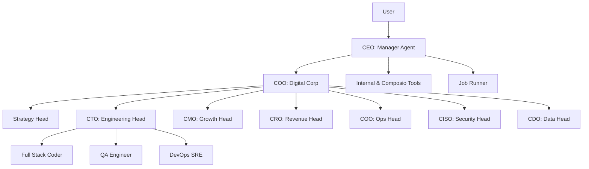

# Architecture Overview

ZilMate is built on a multi-tier agentic architecture designed for reliability, scalability, and complex task execution.

## High-Level Architecture

The system follows a hierarchical "Digital Corporation" model:

1.  **CEO (Manager Agent)**: The primary entry point for user requests. It orchestrates high-level goals and delegates to subagents or the Digital Corporation.
2.  **COO (Digital Corporation Main Agent)**: Manages the business operations and routes tasks to the appropriate departments.
3.  **Departmental Heads**: 7 leaders (Strategy, CTO, CMO, CRO, Operations, CISO, Data) who manage specialized subagents.
4.  **Specialists**: 30+ narrow-focused agents equipped with specific toolkits (e.g., SEO Expert, Finance Analyst, QA Engineer).

## Runtime Components

-   **CLI (`src/cli/`)**: The primary user interface for local operation.
-   **SDK (`src/server.ts`)**: Provides programmatic access to ZilMate's capabilities for external applications.
-   **Job Runner (`src/jobs/runner.ts`)**: Handles background task execution, retries, and scheduling.
-   **Memory System (`src/memory/`)**: Unified storage abstraction supporting local JSON files and Redis (Upstash).
-   **Tool Registry (`src/runtime/registry.ts`)**: Centralized management of internal and external tools.

## Execution Flow

1.  **Input**: A request is received via CLI or SDK.
2.  **Orchestration**: The Manager agent builds a context using memory and situational awareness tools.
3.  **Planning**: The agent decides whether to handle the task directly or delegate to a subagent/swarm.
4.  **Execution**: Tools are called, and the tool loop continues until a resolution is reached or limits are hit.
5.  **Output**: The final result is returned to the user and persisted if necessary.

## Data Flow

-   **Context**: Transient run-time state stored in memory (scratchpad).
-   **Durable Data**: Long-term facts, preferences, and project-specific notes stored in `notebook.md` or Redis.
-   **Artifacts**: Images, logs, and reports generated during execution are stored in the `outputs/` directory.

## Diagrams

## Failure & Retry Boundaries

-   **Job Retries**: Background jobs have a configurable `maxAttempts` and exponential backoff logic in `src/jobs/runner.ts`.
-   **Tool Errors**: Tool execution is wrapped in error handling, allowing the agent to "self-heal" or report the issue.
-   **Model Timeouts**: Managed by the Vercel AI SDK and underlying provider configurations.
