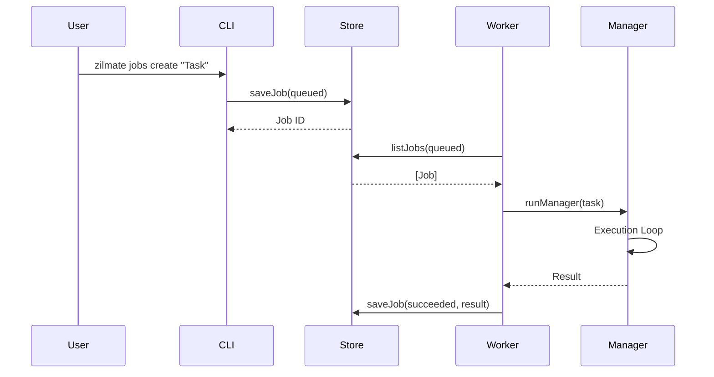

# Workflows

ZilMate orchestrates various business and technical workflows, combining multiple agents and tools to achieve complex goals.

## Swarm Collaboration Workflow

This workflow is used for high-level business tasks that require multi-departmental cooperation.

1.  **Input**: User provides a goal via `zilmate swarm "Task"`.
2.  **Classification**: `SwarmOrchestrator` analyzes the task and selects the lead specialist (e.g., Architect).
3.  **Handoff**: The specialist receives the task and checks the Corporate Notebook for context.
4.  **Execution**: The specialist runs a tool loop, potentially calling other specialists using the `delegateTask` tool.
5.  **Recording**: Each specialist updates their status report via `updateStatusReport`.
6.  **Synthesis**: The lead specialist synthesizes all findings into a final response.

## Background Job Workflow

Automated tasks that run independently of the main chat session.

1.  **Trigger**: Created via CLI, SDK, or external webhook.
2.  **Queueing**: Job is stored in `jobs.json` or Redis with status `queued`.
3.  **Worker Check**: The `JobWorker` (`zilmate jobs worker`) polls for due jobs.
4.  **Execution**: The `JobRunner` invokes the Manager agent with the job's task.
5.  **Logging**: Progress events are captured and saved to `job-logs.json`.
6.  **Rescheduling**: If recurring, the `nextRunAt` is calculated and the job is re-queued.

## Automation & Trigger Workflow

1.  **External Event**: A toolkit event (e.g., New GitHub Issue) is detected.
2.  **Routing**: `trigger-router.ts` matches the event against active policies.
3.  **Action**: A background job is automatically created to handle the event.
4.  **Notification**: The user is notified of the result via Slack, Discord, or the terminal.

## Development & Debugging Workflow

1.  **Error Detection**: User reports a bug or the agent encounters a failure.
2.  **Diagnosis**: Manager agent uses `getSituationBrief` and `filesystem.read` to investigate.
3.  **Correction**: Coding subagent creates a patch or runs a fix command.
4.  **Verification**: Agent runs tests or verifies the fix via `shell.execute`.

## Mermaid Workflow Example (Job Execution)

