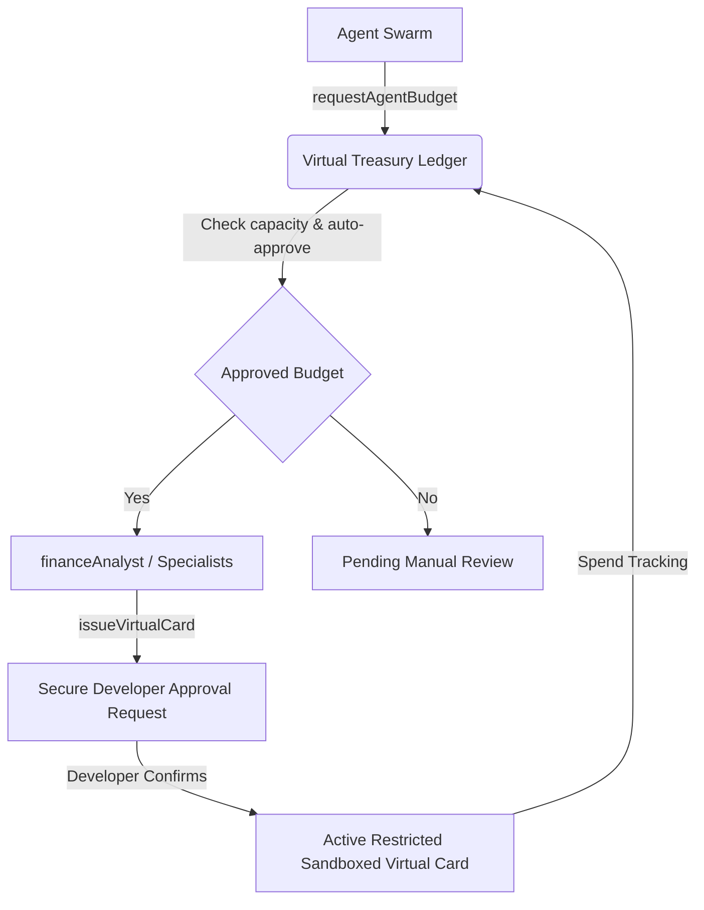
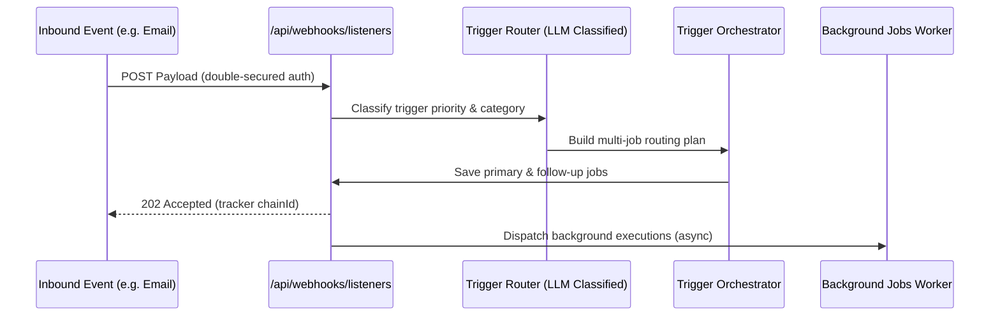

# Swarm Capability Expansions

ZilMate expands beyond standard agent paradigms by incorporating secure decentralized financial controls, real-time proactive communication, and trace-driven prompt self-learning. This guide explains how to leverage these production-ready subsystems.

---

## 🛡️ Swarm Virtual Treasury & Controlled Agent Budgets (Item 1)

Traditional agent execution lacks financial safeguards, making automated business operations risky. ZilMate introduces a **Virtual Treasury** that manages agent allocations and limits spending.



### Ledger Architecture
The treasury ledger persists state in `config/treasury-ledger.json` within the workspace root. It tracks:
*   **Treasury Capacity (`totalCap`):** Overall funding cap for the entire swarm.
*   **Allocated vs. Available:** Real-time visibility into committed funds.
*   **Specialist Budgets:** Individual spending buckets registered to agents.
*   **Virtual Cards:** Issued credentials tied to specific agents, limits, and merchant exclusions.

### Secure Tool Integrations
All ledger actions are executed through dedicated tools:
1.  **`getTreasuryBalance()`**: Query active budgets and card details.
2.  **`requestAgentBudget({ agentName, amount, description })`**: Request budget tokens. Auto-approves if under total cap headroom.
3.  **`issueVirtualCard({ agentName, limit, merchantRestriction })`**: HIGH SECURITY. Triggers our native `requestConfirmation` handler, requiring explicit developer permission before generating a sandboxed card.

---

## ⚡ Proactive Event Webhook Listener & Router (Item 3)

Instead of relying solely on chat loops or fixed polling crons, external platforms can proactively dispatch notifications (emails, Zendesk tickets, Slack alerts) directly into the ZilMate daemon.



### Setup & Endpoints
*   **Route:** `POST http://127.0.0.1:8000/api/webhooks/listeners`
*   **Security:** Double-secured auth. Expects a `Bearer <token>` in the `Authorization` header. Accepts either the ephemeral local `sessionToken` or the corporate `ZILMATE_JOB_WEBHOOK_SECRET` token.
*   **Response:** `202 Accepted` returned immediately along with the tracking `chainId` and the queued job statuses, allowing the calling web service to unblock while the swarm specialists execute in the background.

---

## 🔄 Self-Optimizing Prompt Evolution (Item 4)

ZilMate utilizes **Reinforcement Learning from Agentic Interaction History (RLAIH)**. After each session, the traces are compiled to evolve the system instructions of active specialists.

```mermaid
graph LR
    A[Swarm Traces JSONL] -->|Performance Harvester| B(LLM Trace Analyst)
    B -->|Defensive Guardrails| C[Safety Wiki Guidelines]
    B -->|Offensive Accelerators| D[Success Boosters]
    C & D -->|Deduplicated Corporate Wiki| E[Blackboard Wiki Memory]
    E -->|SwarmAgent.init()| F[Upgraded Specialized Prompt Instructions]
    F -->|Improved Execution| A
```

### Closed-Loop RLAIH Pipeline
1.  **Trace Accumulation:** Spans are logged to `logs/swarm-traces.jsonl` during swarm operations.
2.  **Trace Analyst (`runPostSessionOptimization`):** Analyzes duration, task outcomes, tool usage, and errors.
3.  **Wiki Publication:** Guidelines are published to the Corporate Wiki under `optimization guidelines for [AgentName]`.
    *   *Defensive Guardrails:* Synthesized to prevent recurring failure modes.
    *   *Offensive Accelerators:* Replicates high-efficiency, successful design patterns.
4.  **Automatic Harvest:** On subsequent startups, `SwarmAgent.init()` fetches up to 3 active optimized lessons, injecting them directly into the agent's prompt instructions.

### Run Evolutionary Optimizations On Demand
Expose manual evolutionary training runs directly via the CLI:
```bash
npx zilmate optimize -s <session-id>
```
This command harvests the trace logs of a specific session, dedupes them against existing guidelines, and publishes updated rules to the Corporate Wiki.
